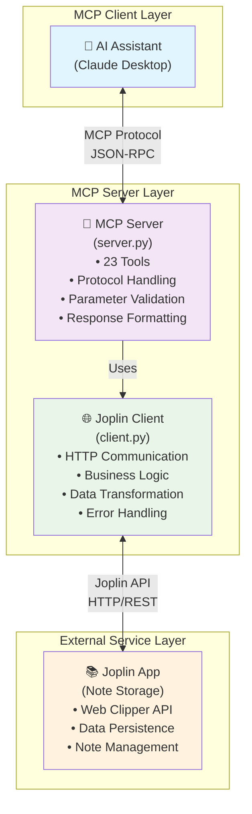

# Joplin MCP Server

A **Model Context Protocol (MCP) server** for [Joplin](https://joplinapp.org/) note-taking application, enabling AI assistants to interact with your Joplin notes, notebooks, and tags through a standardized interface.

## 🎯 Overview

This MCP server provides AI assistants with comprehensive access to your Joplin notes through **23 tools** with complete CRUD operations:

## 🔧 Complete Tool Reference

### 📝 Note Management (5 tools)
- **search_notes** - Full-text search across all notes with advanced filtering
- **get_note** - Retrieve specific notes with metadata and content
- **create_note** - Create new notes with support for todos, tags, and notebooks
- **update_note** - Modify existing notes with flexible parameter support
- **delete_note** - Remove notes with confirmation

### 📁 Notebook Management (7 tools)
- **list_notebooks** - Browse all notebooks with hierarchical structure
- **get_notebook** - Get detailed notebook information
- **create_notebook** - Create new notebooks with parent-child relationships
- **update_notebook** - Modify notebook titles and organization
- **delete_notebook** - Remove notebooks with confirmation
- **search_notebooks** - Find notebooks by name or content
- **get_notes_by_notebook** - List all notes within a specific notebook

### 🏷️ Tag Management (7 tools)
- **list_tags** - View all available tags
- **get_tag** - Retrieve specific tag information
- **create_tag** - Create new tags for organization
- **update_tag** - Modify tag names and properties
- **delete_tag** - Remove tags with confirmation
- **search_tags** - Find tags by name or pattern
- **get_tags_by_note** - List all tags assigned to a specific note

### 🔗 Relationship Management (3 tools)
- **tag_note** - Add tags to notes (create relationships)
- **untag_note** - Remove tags from notes (remove relationships)
- **get_notes_by_tag** - Find all notes with a specific tag

### 🔧 System Tools (1 tool)
- **ping_joplin** - Test server connectivity and health

## 🚀 Quick Start

### Option 1: Direct Ollama Integration (Easiest)

The fastest way to get started is with our interactive Ollama client:

```bash
# 1. Clone and install
git clone https://github.com/alondmnt/joplin-mcp.git
cd joplin-mcp
pip install -e .

# 2. Configure Joplin (see Configuration section below)
# Create joplin-mcp.json with your API token

# 3. Install and setup Ollama
curl -fsSL https://ollama.ai/install.sh | sh
ollama pull gemma3:4b

# 4. Start chatting!
python run_mcp_server.py        # Terminal 1
python ollama_mcp_client.py     # Terminal 2 - Interactive chat starts
```

You'll immediately have an AI assistant that can search, create, and manage your Joplin notes through natural conversation!

### Option 2: Standard MCP Server Setup

### Prerequisites

- **Python 3.8+**
- **Joplin Desktop** with Web Clipper service enabled
- **Joplin API token** (generated in Joplin settings)

### Installation

```bash
# Clone the repository
git clone https://github.com/alondmnt/joplin-mcp.git
cd joplin-mcp

# Install the package
pip install -e .
```

### Configuration

#### 1. Enable Joplin Web Clipper
- Open Joplin Desktop
- Go to **Tools → Options → Web Clipper**
- Enable the Web Clipper service
- Note the port (default: 41184)

#### 2. Get Your API Token
- In Web Clipper settings, copy the **Authorization token**
- Or click **"Advanced options"** to generate a new token

#### 3. Create Configuration File
Create `joplin-mcp.json` in your project directory:

```json
{
  "token": "your_api_token_here",
  "host": "localhost",
  "port": 41184,
  "timeout": 30,
  "verify_ssl": false
}
```

#### 4. Tool Configuration (Optional)

You can **enable or disable individual tools** to customize which operations are available to AI assistants. This is useful for:
- **Security**: Disable destructive operations like `delete_note`, `delete_notebook`, `delete_tag`
- **Simplicity**: Enable only the tools you need
- **Development**: Test specific functionality

##### Basic Tool Configuration

Add a `tools` section to your configuration file:

```json
{
  "token": "your_api_token_here",
  "host": "localhost",
  "port": 41184,
  "tools": {
    "delete_note": false,
    "delete_notebook": false,
    "delete_tag": false
  }
}
```

##### Environment Variables

You can also configure tools via environment variables:

```bash
export JOPLIN_TOOL_DELETE_NOTE=false
export JOPLIN_TOOL_DELETE_NOTEBOOK=false
export JOPLIN_TOOL_DELETE_TAG=false
```

##### Available Tools

All tools are **enabled by default**. Here's the complete list:

| Tool | Category | Description | Default |
|------|----------|-------------|---------|
| `search_notes` | Notes | Search notes with full-text query | ✅ |
| `get_note` | Notes | Retrieve a specific note by ID | ✅ |
| `create_note` | Notes | Create a new note | ✅ |
| `update_note` | Notes | Update an existing note | ✅ |
| `delete_note` | Notes | Delete a note | ✅ |
| `list_notebooks` | Notebooks | List all notebooks | ✅ |
| `get_notebook` | Notebooks | Get notebook details | ✅ |
| `create_notebook` | Notebooks | Create a new notebook | ✅ |
| `update_notebook` | Notebooks | Update an existing notebook | ✅ |
| `delete_notebook` | Notebooks | Delete a notebook | ✅ |
| `search_notebooks` | Notebooks | Search notebooks by name | ✅ |
| `get_notes_by_notebook` | Notebooks | Get all notes in a notebook | ✅ |
| `list_tags` | Tags | List all tags | ✅ |
| `get_tag` | Tags | Get a specific tag by ID | ✅ |
| `create_tag` | Tags | Create a new tag | ✅ |
| `update_tag` | Tags | Update an existing tag | ✅ |
| `delete_tag` | Tags | Delete a tag | ✅ |
| `search_tags` | Tags | Search tags by name | ✅ |
| `get_tags_by_note` | Tags | Get all tags for a note | ✅ |
| `get_notes_by_tag` | Tags | Get all notes with a tag | ✅ |
| `tag_note` | Tags | Add tag to note | ✅ |
| `untag_note` | Tags | Remove tag from note | ✅ |
| `ping_joplin` | Utilities | Test server connection | ✅ |

##### Configuration Examples

**Minimal (disable dangerous operations):**
```json
{
  "host": "localhost",
  "port": 41184,
  "tools": {
    "delete_note": false,
    "delete_notebook": false,
    "delete_tag": false
  }
}
```

**Read-only mode:**
```json
{
  "host": "localhost",
  "port": 41184,
  "tools": {
    "create_note": false,
    "update_note": false,
    "delete_note": false,
    "create_notebook": false,
    "update_notebook": false,
    "delete_notebook": false,
    "create_tag": false,
    "update_tag": false,
    "delete_tag": false,
    "tag_note": false,
    "untag_note": false
  }
}
```

**Test your configuration:**
```bash
python test_tool_config.py
```

#### 5. Test the Connection
```bash
# Test basic connectivity
python test_connection.py

# Run the MCP server
python run_mcp_server.py
```

You should see:
```
🚀 Starting Joplin MCP Server...
✅ Successfully connected to Joplin!
📚 Found X notebooks
🎯 Server starting on localhost:41184
📋 Available tools: 13 tools ready
```

## 📁 Project Structure

### Core Files
- **`run_mcp_server.py`** - Main MCP server launcher script
- **`ollama_mcp_client.py`** - Interactive Ollama chat client (⭐ **New!**)
- **`joplin-mcp.json`** - Configuration file (you create this)
- **`test_connection.py`** - Connection testing utility

### Configuration Files
- **`ollama-mcp-config.json`** - Pre-configured Ollama MCP setup
- **`pyproject.toml`** - Python package configuration
- **`requirements.txt`** - Python dependencies

### Source Code
- **`src/joplin_mcp/`** - Main package directory
  - `server.py` - MCP server implementation (23 tools, protocol handling)
  - `client.py` - Joplin API client (HTTP communication, business logic)
  - `models.py` - Data models and schemas
  - `config.py` - Configuration management
  - `exceptions.py` - Custom exceptions

### Documentation & Testing
- **`docs/`** - API documentation and guides
- **`tests/`** - Comprehensive test suite (300+ tests)
- **`README.md`** - This documentation

## 🦙 Ollama Integration

### Quick Start with Ollama

The easiest way to use this MCP server with Ollama is through our pre-built interactive client:

```bash
# 1. Start the MCP server (in one terminal)
python run_mcp_server.py

# 2. Start the Ollama chat client (in another terminal)
python ollama_mcp_client.py
```

That's it! You'll have an interactive chat session where you can talk to Ollama and it will automatically use your Joplin notes.

### Prerequisites for Ollama Integration

1. **Ollama installed** and running:
   ```bash
   # Install Ollama (macOS/Linux)
   curl -fsSL https://ollama.ai/install.sh | sh
   
   # Or download from https://ollama.ai/
   ```

2. **At least one model downloaded**:
   ```bash
   # Download a recommended model
   ollama pull gemma3:4b
   # or
   ollama pull llama3.2
   ```

3. **Joplin MCP server configured** (see Quick Start section above)

### Method 1: Direct Ollama Client (Recommended)

Our custom Ollama client (`ollama_mcp_client.py`) provides the best experience:

#### Features:
- 🗣️ **Natural conversation** with your Joplin notes
- 🔍 **Automatic tool detection** - Ollama decides when to use Joplin tools
- 📝 **Smart JSON parsing** - Handles Ollama's various response formats
- 🎯 **Real-time feedback** - See exactly what tools are being executed
- 🛠️ **All 23 tools** supported seamlessly

#### Usage Examples:

```bash
# Start the client
python ollama_mcp_client.py

# Example conversations:
💬 You: list all my notebooks
🤖 Assistant: I'll list your Joplin notebooks for you...
[Tool executes and returns your 40 notebooks organized by category]

💬 You: find notes about machine learning
🤖 Assistant: Let me search your notes for machine learning content...
[Searches and returns relevant notes with summaries]

💬 You: create a new note called "Meeting Notes" in my work notebook
🤖 Assistant: I'll create that note for you...
[Creates the note and confirms success]
```

#### Configuration:
Edit `ollama_mcp_client.py` to change the model:

```python
# Change the default model (line ~20)
def __init__(self, ollama_model: str = "gemma3:4b"):  # or "llama3.2", "phi3:latest", etc.
```

#### Available Commands in Chat:
- `help` - Show available commands
- `tools` - List all Joplin tools
- `quit` - Exit the chat

### Method 2: MCP Registry Integration

For advanced users who want to integrate with multiple MCP servers:

#### Step 1: Install MCP Registry
```bash
pip install mcp-registry
```

#### Step 2: Initialize and Add Joplin Server
```bash
# Initialize MCP Registry
mcp-registry init

# Add your Joplin MCP server
mcp-registry add joplin python /path/to/your/joplin-mcp/run_mcp_server.py

# Verify it's registered
mcp-registry list
```

#### Step 3: Test the Integration
```bash
# List available tools
mcp-registry list-tools joplin

# Test a specific tool
mcp-registry test-tool joplin list_notebooks '{}'
```

### Method 3: Manual Ollama MCP Configuration

For direct Ollama MCP integration (requires Ollama with MCP support):

#### Step 1: Create Ollama MCP Config
Create or edit `~/.ollama/mcp-config.json`:

```json
{
  "mcpServers": {
    "joplin": {
      "command": "python",
      "args": ["/Users/yourusername/projects/joplin-mcp/run_mcp_server.py"],
      "env": {
        "PYTHONPATH": "/Users/yourusername/projects/joplin-mcp"
      }
    }
  }
}
```

#### Step 2: Update Paths
Replace `/Users/yourusername/projects/joplin-mcp` with your actual project path.

#### Step 3: Restart Ollama
```bash
# Stop Ollama if running
killall ollama

# Start Ollama with MCP support
ollama serve
```

### Example Conversations with Ollama

Here are real examples of what you can ask:

#### 📚 **Notebook Management**
```
You: "Show me all my notebooks"
Ollama: Lists and categorizes your 40 notebooks by purpose

You: "Create a new notebook called 'AI Projects'"
Ollama: Creates the notebook and confirms with the new ID
```

#### 🔍 **Smart Search**
```
You: "Find all notes about Python programming"
Ollama: Searches your notes and returns relevant matches with summaries

You: "Show me my recent todo items"
Ollama: Finds todo notes and shows their completion status
```

#### ✍️ **Note Creation**
```
You: "Create a meeting note for today's standup"
Ollama: Creates a new note with proper title and structure

You: "Make a todo for 'Review MCP integration' in my work notebook"
Ollama: Creates a todo note in the specified notebook
```

#### 🏷️ **Organization**
```
You: "What tags do I have available?"
Ollama: Lists all your tags

You: "Tag my recent notes about AI with 'important'"
Ollama: Finds recent AI notes and adds the tag
```

### Supported Ollama Models

Tested and working models:
- `gemma3:4b` ⭐ (recommended for JSON tool usage)
- `llama3.2`
- `phi3:latest`
- `orca-mini:latest`

### Troubleshooting Ollama Integration

**Client won't start:**
```bash
# Ensure dependencies are installed
pip install mcp

# Check if Ollama is running
ollama list
```

**Tool execution fails:**
```bash
# Ensure MCP server is running first
python run_mcp_server.py
# Then start the client in another terminal
```

**JSON parsing issues:**
- Some models are better at JSON formatting than others
- The client includes robust JSON extraction for various formats
- Try different models if you have issues

**Connection timeouts:**
- Increase timeout in `ollama_mcp_client.py` if needed
- Ensure your Joplin instance is responsive

## 🔧 Advanced Configuration

### Environment Variables (Alternative)

Instead of the JSON config file, you can use environment variables:

```bash
export JOPLIN_TOKEN="your_api_token_here"
export JOPLIN_HOST="localhost"
export JOPLIN_PORT="41184"
export JOPLIN_TIMEOUT="30"
```

### Configuration Options

| Option | Default | Description |
|--------|---------|-------------|
| `token` | *required* | Joplin API authentication token |
| `host` | `localhost` | Joplin server hostname |
| `port` | `41184` | Joplin Web Clipper port |
| `timeout` | `30` | Request timeout in seconds |
| `verify_ssl` | `false` | SSL certificate verification |

### Programmatic Usage

```python
from joplin_mcp.server import JoplinMCPServer
from joplin_mcp.config import JoplinMCPConfig

# Create configuration
config = JoplinMCPConfig(
    token="your_token",
    host="localhost",
    port=41184,
    timeout=30,
    verify_ssl=False
)

# Initialize server
server = JoplinMCPServer(config=config)

# Use server tools
result = await server.handle_search_notes({
    "query": "meeting notes",
    "limit": 10
})
```

## 📚 Comprehensive Examples

### Advanced Note Search

```python
# Search with multiple filters
search_params = {
    "query": "project planning",
    "limit": 20,
    "notebook_id": "work_notebook_id",
    "tags": ["important", "deadline"],
    "sort_by": "updated_time",
    "sort_order": "desc"
}

results = await server.handle_search_notes(search_params)
```

## 📖 Detailed Tool Reference

### 📝 Note Operations

#### `search_notes`
Full-text search across all notes with advanced filtering options.
```python
{
    "query": "meeting notes",           # Search query (required)
    "limit": 10,                       # Max results (1-100, default: 10)
    "notebook_id": "notebook_123",     # Filter by notebook (optional)
    "tags": ["important", "work"],     # Filter by tags (optional)
    "sort_by": "updated_time",         # Sort field (optional)
    "sort_order": "desc"               # Sort direction (optional)
}
```

#### `get_note`
Retrieve a specific note with full metadata and content.
```python
{
    "note_id": "note_123",             # Note ID (required)
    "include_body": true               # Include note content (default: true)
}
```

#### `create_note`
Create a new note with support for todos, tags, and notebooks.
```python
{
    "title": "Meeting Notes",          # Note title (required)
    "body": "Meeting content...",      # Note content (optional)
    "parent_id": "notebook_123",       # Parent notebook ID (required)
    "is_todo": false,                  # Is this a todo item (default: false)
    "todo_completed": false,           # Todo completion status (default: false)
    "tags": ["work", "meeting"]        # Tags to assign (optional)
}
```

#### `update_note`
Modify existing notes with flexible parameter support.
```python
{
    "note_id": "note_123",             # Note ID (required)
    "title": "Updated Title",          # New title (optional)
    "body": "Updated content...",      # New content (optional)
    "is_todo": true,                   # Update todo status (optional)
    "todo_completed": true             # Update completion (optional)
}
```

#### `delete_note`
Remove a note permanently.
```python
{
    "note_id": "note_123"              # Note ID (required)
}
```

### 📁 Notebook Operations

#### `list_notebooks`
Browse all notebooks with hierarchical structure.
```python
{
    "limit": 50,                       # Max results (1-100, default: 50)
    "sort_by": "title",                # Sort field (optional)
    "sort_order": "asc"                # Sort direction (optional)
}
```

#### `get_notebook`
Get detailed information about a specific notebook.
```python
{
    "notebook_id": "notebook_123"      # Notebook ID (required)
}
```

#### `create_notebook`
Create a new notebook with parent-child relationships.
```python
{
    "title": "Work Projects",          # Notebook title (required)
    "parent_id": "parent_notebook_id"  # Parent notebook ID (optional)
}
```

#### `update_notebook`
Modify notebook titles and organization.
```python
{
    "notebook_id": "notebook_123",     # Notebook ID (required)
    "title": "Updated Title",          # New title (optional)
    "parent_id": "new_parent_id"       # New parent ID (optional)
}
```

#### `delete_notebook`
Remove a notebook permanently.
```python
{
    "notebook_id": "notebook_123"      # Notebook ID (required)
}
```

#### `search_notebooks`
Find notebooks by name or content.
```python
{
    "query": "work",                   # Search query (required)
    "limit": 20                        # Max results (1-100, default: 20)
}
```

#### `get_notes_by_notebook`
List all notes within a specific notebook.
```python
{
    "notebook_id": "notebook_123",     # Notebook ID (required)
    "limit": 20,                       # Max results (1-100, default: 20)
    "sort_by": "updated_time",         # Sort field (optional)
    "sort_order": "desc"               # Sort direction (optional)
}
```

### 🏷️ Tag Operations

#### `list_tags`
View all available tags.
```python
{
    "limit": 50,                       # Max results (1-100, default: 50)
    "sort_by": "title",                # Sort field (optional)
    "sort_order": "asc"                # Sort direction (optional)
}
```

#### `get_tag`
Retrieve specific tag information.
```python
{
    "tag_id": "tag_123"                # Tag ID (required)
}
```

#### `create_tag`
Create a new tag for organization.
```python
{
    "title": "important"               # Tag name (required)
}
```

#### `update_tag`
Modify tag names and properties.
```python
{
    "tag_id": "tag_123",               # Tag ID (required)
    "title": "very-important"          # New tag name (required)
}
```

#### `delete_tag`
Remove a tag permanently.
```python
{
    "tag_id": "tag_123"                # Tag ID (required)
}
```

#### `search_tags`
Find tags by name or pattern.
```python
{
    "query": "work",                   # Search query (required)
    "limit": 20                        # Max results (1-100, default: 20)
}
```

#### `get_tags_by_note`
List all tags assigned to a specific note.
```python
{
    "note_id": "note_123",             # Note ID (required)
    "limit": 20                        # Max results (1-100, default: 20)
}
```

### 🔗 Relationship Operations

#### `tag_note`
Add tags to notes (create relationships).
```python
{
    "note_id": "note_123",             # Note ID (required)
    "tag_id": "tag_123"                # Tag ID (required)
}
```

#### `untag_note`
Remove tags from notes (remove relationships).
```python
{
    "note_id": "note_123",             # Note ID (required)
    "tag_id": "tag_123"                # Tag ID (required)
}
```

#### `get_notes_by_tag`
Find all notes with a specific tag.
```python
{
    "tag_id": "important",             # Tag ID or name (required)
    "limit": 20,                       # Max results (1-100, default: 20)
    "sort_by": "updated_time",         # Sort field (optional)
    "sort_order": "desc"               # Sort direction (optional)
}
```

### 🔧 System Operations

#### `ping_joplin`
Test server connectivity and health.
```python
{}                                     # No parameters required
```

## 🏗️ Architecture

Our MCP implementation follows a clean three-layer architecture that separates concerns for maintainability and flexibility:



### Component Roles

**🔧 MCP Server (`server.py`)**
- Speaks MCP protocol with AI assistants
- Defines and validates all 23 tools
- Handles parameter validation and intelligent corrections
- Formats responses for optimal AI comprehension
- Manages error handling and user feedback

**🌐 Joplin Client (`client.py`)**
- Communicates with Joplin's Web Clipper API
- Handles HTTP requests and connection management
- Implements business logic for complex operations
- Manages data transformation and caching
- Provides error resilience and retry logic

**🤖 AI Assistant (External)**
- Sends MCP requests to our server
- Receives structured, human-readable responses
- Integrates Joplin capabilities into conversations

### Request Flow Example

When you ask Claude to "search for notes with template tag":

1. **Claude Desktop** (MCP Client) sends MCP request:
   ```json
   {
     "tool": "get_notes_by_tag",
     "arguments": {"tag_id": "template"}
   }
   ```

2. **Server** (`server.py`) receives request:
   - Validates parameters
   - Resolves "template" → actual tag ID
   - Calls the client layer

3. **Client** (`client.py`) executes:
   - Makes HTTP request to Joplin API
   - Processes the response
   - Returns structured data

4. **Server** formats response:
   - Converts to human-readable format
   - Adds metadata and context
   - Returns MCP-compliant response

5. **Claude Desktop** receives formatted results and shows them to you

### Architecture Benefits

**Separation of Concerns**:
- **Server**: Handles MCP protocol and user experience
- **Client**: Handles Joplin API specifics and data management

**Flexibility**:
- Can swap out the client to support other note-taking apps
- Can reuse the client in non-MCP contexts
- Server can be enhanced without touching API logic

**Maintainability**:
- Clear boundaries between protocol handling and business logic
- Easier to debug and test individual components
- Cleaner code organization