# Joplin MCP Server

A **FastMCP-based Model Context Protocol (MCP) server** for [Joplin](https://joplinapp.org/) note-taking application via its Pythohn API [joppy](https://github.com/marph91/joppy), enabling AI assistants to interact with your Joplin notes, notebooks, and tags through a standardized interface.

## 🎯 Overview

This FastMCP server provides AI assistants with comprehensive access to your Joplin notes through **23 tools** with complete CRUD operations:

## 🔧 Complete Tool Reference

**23 tools** organized by category and permission level:

| Tool | Category | Permission Level | Description |
|------|----------|------------------|-------------|
| **📝 Note Management** | | | |
| `search_notes` | Notes | 🔍 Read | Full-text search across all notes with advanced filtering |
| `get_note` | Notes | 🔍 Read | Retrieve specific notes with metadata and content |
| `create_note` | Notes | 📝 Write | Create new notes with support for todos, tags, and notebooks |
| `update_note` | Notes | ✏️ Update | Modify existing notes with flexible parameter support |
| `delete_note` | Notes | 🗑️ Delete | Remove notes with confirmation |
| **📁 Notebook Management** | | | |
| `list_notebooks` | Notebooks | 🔍 Read | Browse all notebooks with hierarchical structure |
| `get_notebook` | Notebooks | 🔍 Read | Get detailed notebook information |
| `create_notebook` | Notebooks | 📝 Write | Create new notebooks with parent-child relationships |
| `update_notebook` | Notebooks | ✏️ Update | Modify notebook titles and organization |
| `delete_notebook` | Notebooks | 🗑️ Delete | Remove notebooks with confirmation |
| `search_notebooks` | Notebooks | 🔍 Read | Find notebooks by name or content |
| `get_notes_by_notebook` | Notebooks | 🔍 Read | List all notes within a specific notebook |
| **🏷️ Tag Management** | | | |
| `list_tags` | Tags | 🔍 Read | View all available tags |
| `get_tag` | Tags | 🔍 Read | Retrieve specific tag information |
| `create_tag` | Tags | 📝 Write | Create new tags for organization |
| `update_tag` | Tags | ✏️ Update | Modify tag names and properties |
| `delete_tag` | Tags | 🗑️ Delete | Remove tags with confirmation |
| `search_tags` | Tags | 🔍 Read | Find tags by name or pattern |
| `get_tags_by_note` | Tags | 🔍 Read | List all tags assigned to a specific note |
| `get_notes_by_tag` | Tags | 🔍 Read | Find all notes with a specific tag |
| **🔗 Relationship Management** | | | |
| `tag_note` | Tags | ✏️ Update | Add tags to notes (create relationships) |
| `untag_note` | Tags | ✏️ Update | Remove tags from notes (remove relationships) |
| **🔧 System Tools** | | | |
| `ping_joplin` | Utilities | 🔍 Read | Test server connectivity and health |

**Permission Levels:**
- 🔍 **Read**: Always enabled - safe operations for browsing and searching
- 📝 **Write**: Create new objects (configurable during installation)
- ✏️ **Update**: Modify existing objects (configurable during installation)  
- 🗑️ **Delete**: Remove objects permanently (configurable during installation)

## 🚀 Quick Start

### Option 1: Pip Install (Recommended for most users)

The simplest way to install for end users:

```bash
# Install the package
pip install joplin-mcp

# Run the configuration script (any of these work):
joplin-mcp-install           # Console command (recommended)
python -m joplin_mcp.install # Module command
```

**Available commands after pip install:**
- `joplin-mcp-install` - Interactive configuration script
- `joplin-mcp-server` - Run the MCP server  
- `joplin-mcp` - Run the MCP server (alias)

This approach:
- ✅ Handles all dependencies automatically
- ✅ Works in any Python environment
- ✅ Provides the same configuration experience
- ✅ Installs the package globally or in your current environment
- ✅ Provides convenient console commands

### Option 2: Development Install

For developers or users who want the latest features:

#### For macOS/Linux users:
```bash
# Clone the repository
git clone https://github.com/alondmnt/joplin-mcp.git
cd joplin-mcp

# Run the installation script (includes virtual environment setup)
./install.sh
```

#### For Windows users:
```batch
REM Clone the repository
git clone https://github.com/alondmnt/joplin-mcp.git
cd joplin-mcp

REM Run the installation script
install.bat
```

#### Or run the Python script directly:
```bash
python install.py
```

**Both approaches provide:**
1. ✅ Prompt you for your Joplin API token
2. ✅ Configure tool permissions (3 levels: Write, Update, Delete)
3. ✅ Create the `joplin-mcp.json` configuration file
4. ✅ Find and update your Claude Desktop configuration
5. ✅ Test the connection to Joplin
6. ✅ Provide detailed setup instructions

### Manual Installation

If you prefer to set up manually or the automated script doesn't work for your setup:

### Prerequisites

- **Python 3.8+**
- **Joplin Desktop** with Web Clipper service enabled
- **Joplin API token** (generated in Joplin settings)

### Installation

```bash
# Clone the repository
git clone https://github.com/alondmnt/joplin-mcp.git
cd joplin-mcp

# Install the package
pip install -e .
```

### Configuration

#### 1. Enable Joplin Web Clipper
- Open Joplin Desktop
- Go to **Tools → Options → Web Clipper**
- Enable the Web Clipper service
- Note the port (default: 41184)

#### 2. Get Your API Token
- In Web Clipper settings, copy the **Authorization token**
- Or click **"Advanced options"** to generate a new token

#### 3. Create Configuration File
Create `joplin-mcp.json` in your project directory:

```json
{
  "token": "your_api_token_here",
  "host": "localhost",
  "port": 41184,
  "timeout": 30,
  "verify_ssl": false
}
```

#### 4. Tool Permission Configuration

The installation script provides **3 levels of permission control** for enhanced security:

##### 📝 **Write Permission** (Creating new objects)
- `create_note` - Create new notes
- `create_notebook` - Create new notebooks  
- `create_tag` - Create new tags

##### ✏️ **Update Permission** (Modifying existing objects)
- `update_note` - Update existing notes
- `update_notebook` - Update existing notebooks
- `update_tag` - Update existing tags
- `tag_note` - Add tags to notes
- `untag_note` - Remove tags from notes

##### 🗑️ **Delete Permission** (Permanently removing objects)
- `delete_note` - Delete notes
- `delete_notebook` - Delete notebooks
- `delete_tag` - Delete tags

The installation script will prompt you for each permission level and configure the tools accordingly. This provides fine-grained control over what operations the AI assistant can perform.

##### Manual Tool Configuration

If you need to modify permissions later, edit the `tools` section in your configuration file:

```json
{
  "token": "your_api_token_here",
  "host": "localhost",
  "port": 41184,
  "tools": {
    "create_note": true,
    "create_notebook": true,
    "create_tag": true,
    "update_note": true,
    "update_notebook": true,
    "update_tag": true,
    "tag_note": true,
    "untag_note": true,
    "delete_note": false,
    "delete_notebook": false,
    "delete_tag": false
  }
}
```

##### Environment Variables

You can also configure tools via environment variables:

```bash
export JOPLIN_TOOL_DELETE_NOTE=false
export JOPLIN_TOOL_DELETE_NOTEBOOK=false
export JOPLIN_TOOL_DELETE_TAG=false
```


##### Configuration Examples

**Recommended (Write + Update, no Delete):**
```json
{
  "host": "localhost",
  "port": 41184,
  "tools": {
    "create_note": true,
    "create_notebook": true,
    "create_tag": true,
    "update_note": true,
    "update_notebook": true,
    "update_tag": true,
    "tag_note": true,
    "untag_note": true,
    "delete_note": false,
    "delete_notebook": false,
    "delete_tag": false
  }
}
```

**Conservative (Write only):**
```json
{
  "host": "localhost",
  "port": 41184,
  "tools": {
    "create_note": true,
    "create_notebook": true,
    "create_tag": true,
    "update_note": false,
    "update_notebook": false,
    "update_tag": false,
    "tag_note": false,
    "untag_note": false,
    "delete_note": false,
    "delete_notebook": false,
    "delete_tag": false
  }
}
```

**Read-only mode:**
```json
{
  "host": "localhost",
  "port": 41184,
  "tools": {
    "create_note": false,
    "create_notebook": false,
    "create_tag": false,
    "update_note": false,
    "update_notebook": false,
    "update_tag": false,
    "tag_note": false,
    "untag_note": false,
    "delete_note": false,
    "delete_notebook": false,
    "delete_tag": false
  }
}
```

#### 5. Test the Connection

**For pip install:**
```bash
# Run the FastMCP server (any of these work):
joplin-mcp-server            # Console command (recommended)
joplin-mcp                   # Alias command
python -m joplin_mcp.server  # Module command
```

**For development install:**
```bash
# Run the FastMCP server
python run_fastmcp_server.py
```

You should see:
```
🚀 Starting Joplin FastMCP Server...
✅ Successfully connected to Joplin!
📚 Found X notebooks, Y notes, Z tags
🎯 FastMCP server starting...
📋 Available tools: 23 tools ready
```

## 📁 Project Structure

### Core Files
- **`run_fastmcp_server.py`** - FastMCP server launcher script
- **`joplin-mcp.json`** - Configuration file (you create this)

### Configuration Files
- **`pyproject.toml`** - Python package configuration
- **`requirements.txt`** - Python dependencies

### Source Code
- **`src/joplin_mcp/`** - Main package directory
  - `fastmcp_server.py` - FastMCP server implementation (23 tools, protocol handling)
  - `models.py` - Data models and schemas
  - `config.py` - Configuration management
  - `exceptions.py` - Custom exceptions

### Documentation & Testing
- **`docs/`** - API documentation and guides
- **`tests/`** - FastMCP test suite
- **`README.md`** - This documentation

## 🔧 Claude Desktop Integration

### Claude Desktop Configuration

The configuration depends on your installation method:

#### For Pip Install:
```json
{
  "mcpServers": {
    "joplin": {
      "command": "joplin-mcp-server",
      "env": {
        "JOPLIN_TOKEN": "your_token_here"
      }
    }
  }
}
```

*Alternative commands that also work:*
```json
{
  "mcpServers": {
    "joplin": {
      "command": "joplin-mcp",
      "env": {
        "JOPLIN_TOKEN": "your_token_here"
      }
    }
  }
}
```

*Or using Python module:*
```json
{
  "mcpServers": {
    "joplin": {
      "command": "python",
      "args": ["-m", "joplin_mcp.server"],
      "env": {
        "JOPLIN_TOKEN": "your_token_here"
      }
    }
  }
}
```

#### For Development Install:
```json
{
  "mcpServers": {
    "joplin": {
      "command": "python",
      "args": ["/path/to/your/joplin-mcp/run_fastmcp_server.py"],
      "env": {
        "PYTHONPATH": "/path/to/your/joplin-mcp",
        "JOPLIN_TOKEN": "your_token_here"
      }
    }
  }
}
```

Replace `/path/to/your/joplin-mcp` with your actual project path.

**Note:** The installation commands (`joplin-mcp-install`, `./install.sh`, or `install.py`) automatically configure this for you!

### Usage with Claude Desktop

Once configured, you can:

- **📚 Manage Notebooks**: "List all my notebooks" or "Create a new notebook called 'AI Projects'"
- **🔍 Search Notes**: "Find all notes about Python programming" or "Show me my recent todo items"
- **✍️ Create Content**: "Create a meeting note for today's standup" or "Make a todo for 'Review MCP integration'"
- **🏷️ Organize**: "What tags do I have available?" or "Tag my recent notes about AI with 'important'"

## 🔧 Advanced Configuration

### Environment Variables (Alternative)

Instead of the JSON config file, you can use environment variables:

```bash
export JOPLIN_TOKEN="your_api_token_here"
export JOPLIN_HOST="localhost"
export JOPLIN_PORT="41184"
export JOPLIN_TIMEOUT="30"
```

### Configuration Options

| Option | Default | Description |
|--------|---------|-------------|
| `token` | *required* | Joplin API authentication token |
| `host` | `localhost` | Joplin server hostname |
| `port` | `41184` | Joplin Web Clipper port |
| `timeout` | `30` | Request timeout in seconds |
| `verify_ssl` | `false` | SSL certificate verification |

### Programmatic Usage

```python
from joplin_mcp.config import JoplinMCPConfig
from joplin_mcp.fastmcp_server import app

# Create configuration
config = JoplinMCPConfig(
    token="your_token",
    host="localhost",
    port=41184,
    timeout=30,
    verify_ssl=False
)

# Configuration is loaded automatically from joplin-mcp.json
# or you can set environment variables:
# export JOPLIN_TOKEN="your_token"
# export JOPLIN_HOST="localhost"
# export JOPLIN_PORT="41184"

# The FastMCP server can be run with:
# pip install: joplin-mcp-server  
# development: python run_fastmcp_server.py
```

## 📚 Comprehensive Examples

### Advanced Note Search

```python
# Search with multiple filters
search_params = {
    "query": "project planning",
    "limit": 20,
    "notebook_id": "work_notebook_id",
    "tags": ["important", "deadline"],
    "sort_by": "updated_time",
    "sort_order": "desc"
}

results = await server.handle_search_notes(search_params)
```

## 📖 Detailed Tool Reference

### 📝 Note Operations

#### `search_notes`
Full-text search across all notes with advanced filtering options.
```python
{
    "query": "meeting notes",           # Search query (required)
    "limit": 10,                       # Max results (1-100, default: 10)
    "notebook_id": "notebook_123",     # Filter by notebook (optional)
    "tags": ["important", "work"],     # Filter by tags (optional)
    "sort_by": "updated_time",         # Sort field (optional)
    "sort_order": "desc"               # Sort direction (optional)
}
```

#### `get_note`
Retrieve a specific note with full metadata and content.
```python
{
    "note_id": "note_123",             # Note ID (required)
    "include_body": true               # Include note content (default: true)
}
```

#### `create_note`
Create a new note with support for todos, tags, and notebooks.
```python
{
    "title": "Meeting Notes",          # Note title (required)
    "body": "Meeting content...",      # Note content (optional)
    "parent_id": "notebook_123",       # Parent notebook ID (required)
    "is_todo": false,                  # Is this a todo item (default: false)
    "todo_completed": false,           # Todo completion status (default: false)
    "tags": ["work", "meeting"]        # Tags to assign (optional)
}
```

#### `update_note`
Modify existing notes with flexible parameter support.
```python
{
    "note_id": "note_123",             # Note ID (required)
    "title": "Updated Title",          # New title (optional)
    "body": "Updated content...",      # New content (optional)
    "is_todo": true,                   # Update todo status (optional)
    "todo_completed": true             # Update completion (optional)
}
```

#### `delete_note`
Remove a note permanently.
```python
{
    "note_id": "note_123"              # Note ID (required)
}
```

### 📁 Notebook Operations

#### `list_notebooks`
Browse all notebooks with hierarchical structure.
```python
{
    "limit": 50,                       # Max results (1-100, default: 50)
    "sort_by": "title",                # Sort field (optional)
    "sort_order": "asc"                # Sort direction (optional)
}
```

#### `get_notebook`
Get detailed information about a specific notebook.
```python
{
    "notebook_id": "notebook_123"      # Notebook ID (required)
}
```

#### `create_notebook`
Create a new notebook with parent-child relationships.
```python
{
    "title": "Work Projects",          # Notebook title (required)
    "parent_id": "parent_notebook_id"  # Parent notebook ID (optional)
}
```

#### `update_notebook`
Modify notebook titles and organization.
```python
{
    "notebook_id": "notebook_123",     # Notebook ID (required)
    "title": "Updated Title",          # New title (optional)
    "parent_id": "new_parent_id"       # New parent ID (optional)
}
```

#### `delete_notebook`
Remove a notebook permanently.
```python
{
    "notebook_id": "notebook_123"      # Notebook ID (required)
}
```

#### `search_notebooks`
Find notebooks by name or content.
```python
{
    "query": "work",                   # Search query (required)
    "limit": 20                        # Max results (1-100, default: 20)
}
```

#### `get_notes_by_notebook`
List all notes within a specific notebook.
```python
{
    "notebook_id": "notebook_123",     # Notebook ID (required)
    "limit": 20,                       # Max results (1-100, default: 20)
    "sort_by": "updated_time",         # Sort field (optional)
    "sort_order": "desc"               # Sort direction (optional)
}
```

### 🏷️ Tag Operations

#### `list_tags`
View all available tags.
```python
{
    "limit": 50,                       # Max results (1-100, default: 50)
    "sort_by": "title",                # Sort field (optional)
    "sort_order": "asc"                # Sort direction (optional)
}
```

#### `get_tag`
Retrieve specific tag information.
```python
{
    "tag_id": "tag_123"                # Tag ID (required)
}
```

#### `create_tag`
Create a new tag for organization.
```python
{
    "title": "important"               # Tag name (required)
}
```

#### `update_tag`
Modify tag names and properties.
```python
{
    "tag_id": "tag_123",               # Tag ID (required)
    "title": "very-important"          # New tag name (required)
}
```

#### `delete_tag`
Remove a tag permanently.
```python
{
    "tag_id": "tag_123"                # Tag ID (required)
}
```

#### `search_tags`
Find tags by name or pattern.
```python
{
    "query": "work",                   # Search query (required)
    "limit": 20                        # Max results (1-100, default: 20)
}
```

#### `get_tags_by_note`
List all tags assigned to a specific note.
```python
{
    "note_id": "note_123",             # Note ID (required)
    "limit": 20                        # Max results (1-100, default: 20)
}
```

### 🔗 Relationship Operations

#### `tag_note`
Add tags to notes (create relationships).
```python
{
    "note_id": "note_123",             # Note ID (required)
    "tag_id": "tag_123"                # Tag ID (required)
}
```

#### `untag_note`
Remove tags from notes (remove relationships).
```python
{
    "note_id": "note_123",             # Note ID (required)
    "tag_id": "tag_123"                # Tag ID (required)
}
```

#### `get_notes_by_tag`
Find all notes with a specific tag.
```python
{
    "tag_id": "important",             # Tag ID or name (required)
    "limit": 20,                       # Max results (1-100, default: 20)
    "sort_by": "updated_time",         # Sort field (optional)
    "sort_order": "desc"               # Sort direction (optional)
}
```

### 🔧 System Operations

#### `ping_joplin`
Test server connectivity and health.
```python
{}                                     # No parameters required
```

## 🔧 Installation Troubleshooting

If you encounter issues with the automated installation script, here are common solutions:

### Common Issues and Solutions

#### Python Not Found
- **Issue**: `Python 3 is required but not found in PATH`
- **Solution**: Install Python 3.8+ from [python.org](https://python.org) and ensure it's added to your PATH

#### Package Installation Issues
- **Issue**: `pip install joplin-mcp` fails or package not found
- **Solution**: Package may not be published yet. Use development install instead:
  ```bash
  git clone https://github.com/alondmnt/joplin-mcp.git
  cd joplin-mcp
  pip install -e .
  ```

#### Joplin Connection Failed
- **Issue**: Cannot connect to Joplin during installation
- **Solution**: 
  1. Ensure Joplin Desktop is running
  2. Enable Web Clipper: Tools → Options → Web Clipper
  3. Verify the port (default: 41184)
  4. Check your firewall settings

#### Claude Desktop Config Not Found
- **Issue**: Installation script can't find Claude Desktop config
- **Solution**: Manually add the MCP server configuration to your Claude Desktop config file:
  
  **macOS:** `~/Library/Application Support/Claude/claude_desktop_config.json`
  **Linux:** `~/.config/claude-desktop/claude_desktop_config.json`
  **Windows:** `%APPDATA%\Claude\claude_desktop_config.json`

#### Token Issues
- **Issue**: Invalid or expired API token
- **Solution**: Generate a new token in Joplin:
  1. Go to Tools → Options → Web Clipper
  2. Click "Advanced options"
  3. Copy the Authorization token
  4. Run the installation script again

#### Permission Errors
- **Issue**: Permission denied when updating Claude Desktop config
- **Solution**: Run the installation script with appropriate permissions or manually edit the config file

### Manual Claude Desktop Configuration

If the automated installation doesn't update your Claude Desktop config, add this manually:

```json
{
  "mcpServers": {
    "joplin": {
      "command": "python",
      "args": ["/path/to/joplin-mcp/run_fastmcp_server.py"],
      "cwd": "/path/to/joplin-mcp",
      "env": {
        "PYTHONPATH": "/path/to/joplin-mcp",
        "JOPLIN_TOKEN": "your_token_here"
      }
    }
  }
}
```

Replace `/path/to/joplin-mcp` with the actual path to your installation directory.

### Getting Help

If you're still having issues:
1. Check the `docs/troubleshooting.md` file
2. Review the installation logs for detailed error messages
3. Ensure all prerequisites are met
4. Try the manual installation steps below

## 🏗️ Architecture

Our FastMCP implementation provides a streamlined, efficient architecture built on the modern FastMCP framework:

```mermaid
graph TB
    subgraph "MCP Client Layer"
        AI["🤖 AI Assistant<br/>(Claude Desktop)"]
    end
    
    subgraph "FastMCP Server Layer"
        SERVER["🔧 FastMCP Server<br/>(fastmcp_server.py)<br/>• 23 Tools<br/>• Protocol Handling<br/>• Parameter Validation<br/>• Response Formatting<br/>• Direct Joplin API Integration"]
    end
    
    subgraph "External Service Layer"
        JOPLIN["📚 Joplin App<br/>(Note Storage)<br/>• Web Clipper API<br/>• Data Persistence<br/>• Note Management"]
    end
    
    AI <-->|"MCP Protocol<br/>JSON-RPC"| SERVER
    SERVER <-->|"Joplin API<br/>HTTP/REST"| JOPLIN
    
    style AI fill:#e1f5fe
    style SERVER fill:#f3e5f5
    style JOPLIN fill:#fff3e0
```



### Component Roles

**🔧 FastMCP Server (`fastmcp_server.py`)**
- Built on modern FastMCP framework
- Speaks MCP protocol with AI assistants
- Defines and validates all 23 tools
- Handles parameter validation and intelligent corrections
- Communicates directly with Joplin's Web Clipper API
- Manages HTTP requests and connection management
- Implements business logic for complex operations
- Provides error resilience and retry logic
- Formats responses for optimal AI comprehension

**🤖 AI Assistant (External)**
- Sends MCP requests to our server
- Receives structured, human-readable responses
- Integrates Joplin capabilities into conversations

### Request Flow Example

When you ask Claude to "search for notes with template tag":

1. **Claude Desktop** (MCP Client) sends MCP request:
   ```json
   {
     "tool": "get_notes_by_tag",
     "arguments": {"tag_id": "template"}
   }
   ```

2. **FastMCP Server** (`fastmcp_server.py`) receives request:
   - Validates parameters
   - Resolves "template" → actual tag ID
   - Makes HTTP request to Joplin API
   - Processes the response
   - Formats response for AI comprehension

3. **Response** sent back to Claude:
   - Structured, human-readable format
   - Rich metadata and context
   - Error handling and user feedback
   - Returns MCP-compliant response

5. **Claude Desktop** receives formatted results and shows them to you

### Architecture Benefits

**Separation of Concerns**:
- **Server**: Handles MCP protocol and user experience
- **Client**: Handles Joplin API specifics and data management

**Flexibility**:
- Can swap out the client to support other note-taking apps
- Can reuse the client in non-MCP contexts
- Server can be enhanced without touching API logic

**Maintainability**:
- Clear boundaries between protocol handling and business logic
- Easier to debug and test individual components
- Cleaner code organization